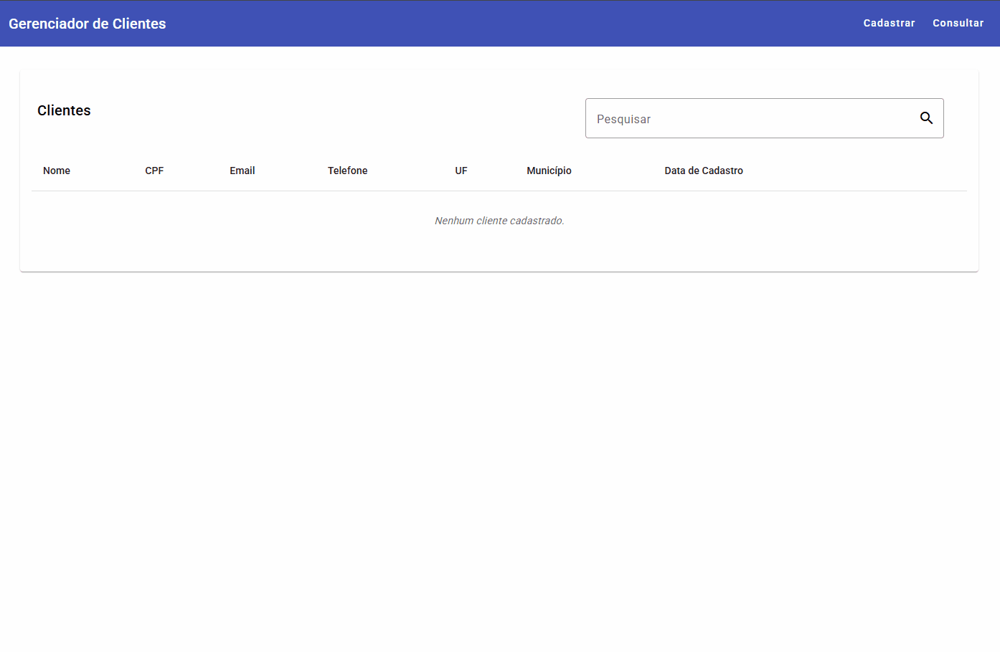

# Gerenciador de Clientes

Esta é uma aplicação de **gestão de clientes** desenvolvida para consolidar os fundamentos do **Angular**. O foco do projeto foi aplicar na prática um **CRUD** completo com **persistência local**, **validações dinâmicas** e **integração com serviços externos**.

## Demonstração

A aplicação oferece um fluxo fluido para o gerenciamento de clientes, incluindo **máscaras em tempo real**, **busca instantânea** e **animações de transição**.

<p align="center">  </p>

Acesse a aplicação online: [Gerenciador de Clientes](https://josecampelo.github.io/gerenciador-clientes-angular/).

## Tecnologias e Ferramentas

* **Angular 19**: Desenvolvimento moderno utilizando Standalone Components e a nova sintaxe de controle de fluxo (``@for``, ``@if``).
* **Angular Material**: Utilização de componentes como ``mat-table``, ``mat-card``, ``mat-select`` e ``mat-snack-bar``.
* **Angular Animations**: Criação de transições suaves (``fadeOut``) na remoção de registros da tabela.
* **ngx-mask**: Implementação de máscaras dinâmicas para CPF e Telefone.
* **LocalStorage**: Persistência de dados no navegador para simular o comportamento de um banco de dados.
* **BrasilAPI**: Integração com serviços de busca do IBGE para carregamento dinâmico de UFs e Municípios.

## Funcionalidades Principais

* **CRUD Completo**: Cadastro, listagem, edição e exclusão de clientes com IDs únicos (UUID).
* **Busca em Tempo Real**: Filtro reativo na tabela de consulta que atualiza os resultados conforme a digitação.
* **Dropdowns em Cascata**: Seleção de Municípios dependente da UF selecionada, consumindo dados em tempo real.
* **Confirmação de Exclusão Inline**: Sistema de segurança que solicita confirmação antes de remover um registro, sem interromper o fluxo do usuário.
* **Feedback ao Usuário**: Notificações via SnackBar para confirmação de ações bem-sucedidas.

## Conceitos Praticados

* **Serviços e HttpClient**: Centralização da lógica de negócio e consumo de APIs REST.
* **Formulários Reativos (``ReactiveFormsModule``)**: Validações customizadas, controle de estado de campos e uso de ``patchValue``.
* **Roteamento Avançado**: Uso de parâmetros de rota (``:id``) para reutilização de componentes em modo de edição e redirecionamentos (``pathMatch: 'full'``).
* **Comunicação entre Componentes**: Gerenciamento de estado de visualização para lidar com listas filtradas e originais.

## Como rodar o projeto localmente

1. **Clone este repositório**:

    ```bash
    git clone https://github.com/josecampelo/gerenciador-clientes-angular.git
    ```
2. **Acesse a pasta do projeto**:

    ```bash
    cd gerenciador-clientes-angular
    ```

3. **Instale as dependências**:

    ```bash
    npm install
    ```

4. **Inicie o servidor**:

    ```bash
    ng serve
    ```

5. **Acesse**: ``http://localhost:4200/``.
